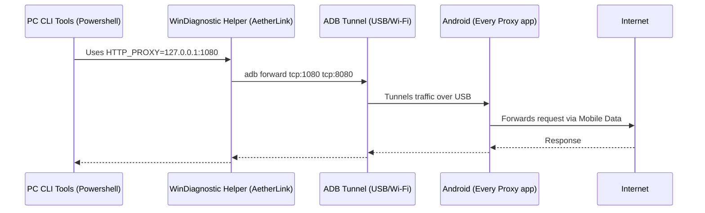

# AetherLink ⚡ (Obfuscated as WinDiagnostic Helper)

> **Stealth Forward Proxy Tethering** — Route PC/Desktop traffic through an Android device invisibly via ADB, disguised as a Windows Service.

## What is AetherLink?

AetherLink is a cross-platform desktop tool (.NET 10 + MAUI) that creates a transparent proxy chain between a host machine and an Android device.

It is specifically designed for environments with strict corporate proxies. It allows your local CLI tools (npm, pip, git, etc.) to securely exit to the internet using your phone's mobile network. To avoid detection, the application runs entirely stealth under the name **"WinDiagnostic Helper"** and minimizes to a background System Tray service.

---

## The Network Flow



---

## Features

- 🔌 **One-click ADB Forward Tethering** — Binds local port 1080 to Android's port 8080.
- 🥷 **Stealth Mode** — UI, Window Title, and binary identity are disguised as "WinDiagnostic Helper".
- 📥 **System Tray Demon** — Closes cleanly into a background taskbar icon out of sight.
- 🖥 **Isolated Terminal Launcher** — Spawns PowerShell with `HTTP_PROXY` pre-injected to strictly isolate your tunneling tools.
- 📦 **Portable ADB** — Bundled `adb.exe` + robust process lifecycle management (no zombie processes).
- 🏗 **Clean Architecture** — MAUI MVVM · SRP · DI.

---

## Architecture

```text
AetherLink/
├── AetherLink.Core/          # Class library (net10.0)
│   ├── Abstractions/         # Interfaces: IAndroidDeviceService, IAdbTunnelService, ITerminalLauncherService
│   ├── Models/               # AndroidDevice (record), TunnelState (enum)
│   └── Services/             # Concrete implementations
│
└── AetherLink.UI/            # MAUI App (Windows)
    ├── ViewModels/           # MainViewModel (ObservableObject + RelayCommands)
    ├── Views/                # MainPage.xaml (Minimalist Flat UI)
    ├── App.xaml.cs           # TaskbarIcon System Tray Hook
    └── adb/                  # Bundled adb.exe
```

---

## Getting Started

```powershell
# Clone
git clone https://github.com/DanielWueno/AetherLink.git
cd AetherLink

# Restore & build
dotnet build

# Run on Windows
dotnet run --project AetherLink.UI/AetherLink.UI.csproj -f net10.0-windows10.0.19041.0
```

---

## How It Works

1. **Prerequisites** — You must have an app like **Every Proxy** running on your Android device exposing an HTTP Proxy on port `8080`.
2. **Scan** — Queries the bundled ADB server for connected devices using strict timeouts to prevent freezing.
3. **Connect** — Executes `adb forward tcp:1080 tcp:8080`, linking your PC's 1080 port to the phone's proxy server over USB.
4. **Test & Terminal** — The app validates the internet connection by querying `ipinfo.io` through the tunnel. If successful, you can launch a sandboxed proxy terminal.
5. **Hide to Tray** — Minimizes the app to the Windows notification tray as "WinDiagnostic Helper", allowing you to work quietly.

---

## License

MIT — see [LICENSE](LICENSE) for details.
